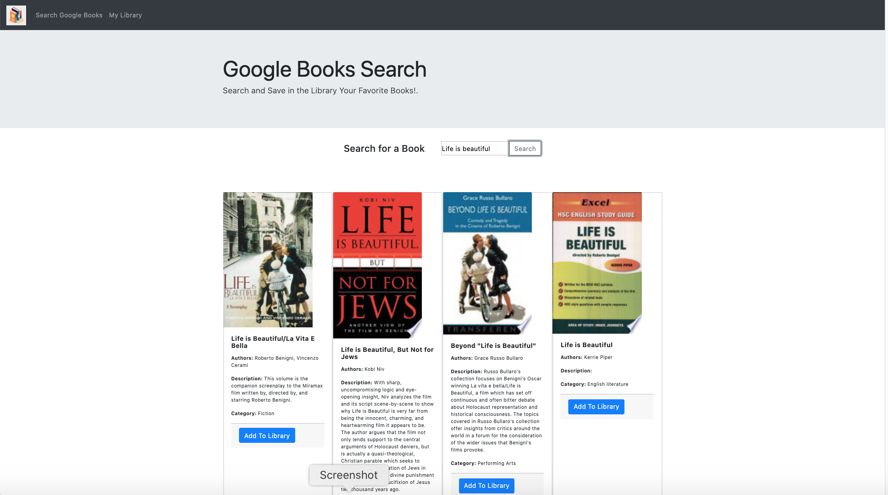
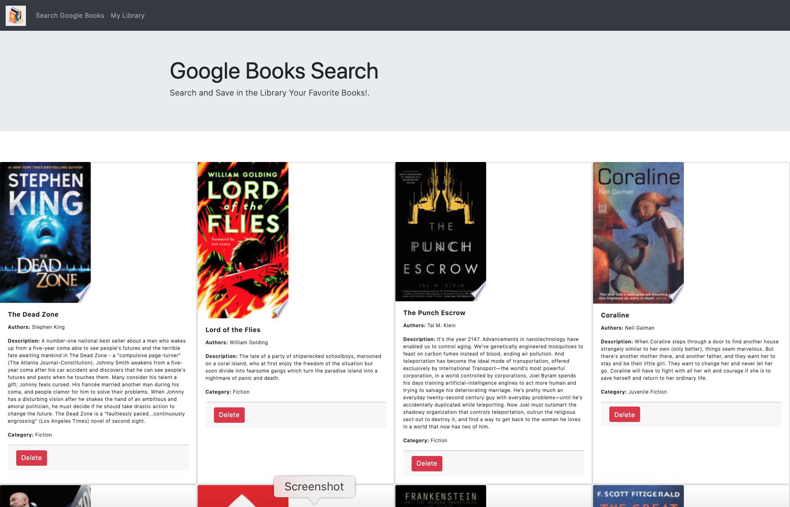
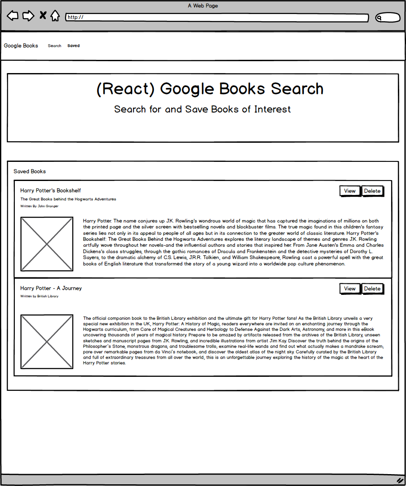

# Full Stack React App - Search Google Books

This is a Full Stack React-based Google Books Search app using MongoDB. This app contains React components, helper/util functions, and uses React lifecycle methods to query and display books based on user searches. Node, Express and MongoDB are used in the backend so that users can save books to review or purchase later.

- - -
## Deployed App in Heroku

[Google Books Search in Heroku]()
- - -
## GitHub Repository

[Google Books Search in GitHub](https://github.com/tomaspz/react-search-google-books)
- - -
## App Screenshot

Search Page



Library Page


- - -
## App Requirements

* This application requires at minimum 2 pages, following the design in these mockup images for each page:

 - In the search page, the user can search for books via the Google Books API and get the results of the search in the same page. The user has the option to "View" a book, bringing them to the book on Google Books, or "Save" a book, saving it to the Mongo database.

 - This page renders all books saved to the Mongo database. User has an option to "View" the book, bringing them to the book on Google Books, or "Delete" a book, removing it from the Mongo database.

* It requires to create the code to connect to a MongoDB database named `library` using the mongoose npm package.

* It requires to create a Book schema using mongoose.

* At a minimum, books should have each of the following fields:

    * `title` - Title of the book from the Google Books API

    * `authors` - The books's author(s) as returned from the Google Books API

    * `description` - The book's description as returned from the Google Books API

    * `image` - The Book's thumbnail image as returned from the Google Books API

    * `link` - The Book's information link as returned from the Google Books API

* The documents in the books collection should be similar to the following:
```
{
  authors: ["Suzanne Collins"]
  description: "Set in a dark vision of the near future, a terrifying reality TV show is taking place. Twelve boys and twelve girls are forced to appear in a live event called The Hunger Games. There is only one rule: kill or be killed. When sixteen-year-old Katniss Everdeen steps forward to take her younger sister's place in the games, she sees it as a death sentence. But Katniss has been close to death before. For her, survival is second nature."
  image: "http://books.google.com/books/content?id=sazytgAACAAJ&printsec=frontcover&img=1&zoom=1&source=gbs_api"
  link: "http://books.google.com/books?id=sazytgAACAAJ&dq=title:The+Hunger+Games&hl=&source=gbs_api"
  title: "The Hunger Games"
}
```
* The layout should be similar to the mockups displayed above. 

* This is a SPA (Single Page Application) that uses react-router-dom to navigate, hide and show the React components without changing the route within Express.

* The layout should include at least two React Components for each page Search and Saved.

* You can use any CSS framework.

* The Express web server should have the following routes for your app:
    * `GET: /api/books` - returns all saved books as JSON.

    * `POST: /api/books` - saves a new book to the database.

    * `DELETE: /api/books/:id` - deletes a book from the database by Mongo _id.

    * `GET: *` - loads a single HTML page in client/build/index.html. This route is set after all other routes are defined.

* Deploy the application to Heroku.
* The app must use Create React App and current versions of React and React-Router-Dom.